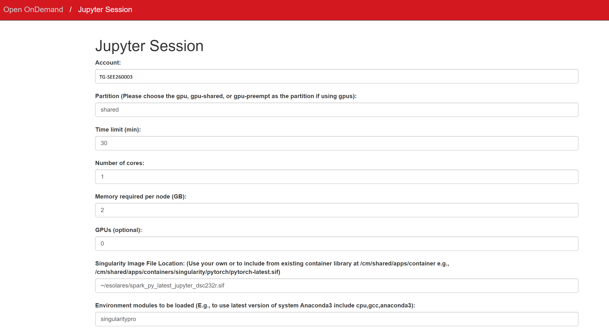
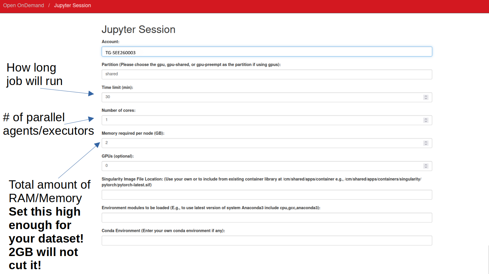
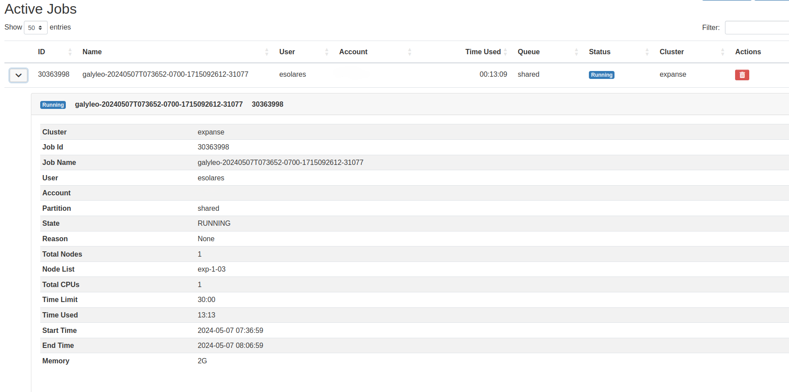

# Group Project Information

## Login to SDSC Expanse
Go to [portal.expanse.sdsc.edu](https://portal.expanse.sdsc.edu/) and login with your "ucsd.edu" credentials, unless instructed otherwise, in which case, you may use your "access-ci.org" credentials (if you have one).

## First-Time Login Instructions

If this is your first time logging in, please follow these steps:

1. **Select Account Type**  
   Choose the **Academic Non-Profit** option.

2. **Accept Terms**  
   Read and accept the terms and conditions.

3. **Handling Permission Denied Error**  
   If you encounter a "permission denied" error, simply click **Logout**.

4. **Link Your Account**  
   - You will be prompted to link your account.
   - You should see a string of random characters followed by `@ucsd.edu`.
   - Below this, you will see options to link your account.

5. **Select Access-CI Account**  
   - Choose the **access-ci** account option.
   - You will then be prompted to log in to **NSF ACCESS**.

## Troubleshooting
If you still encounter errors after logging out, logging back in, and waiting 15 minutes, please submit a support ticket for further assistance [more info here](#support).


## Logging into SDSC
## Portal Navigation
Once you are logged in, you will see the following SDSC Expanse Portal, along with several Pinned Apps. 


We will be working with the following apps:
1. **expanse Shell Acess**: To access Terminal.
2. **Jupyter**: To setup Jupyter notebook and run JupyterLab.
3. **Active Jobs**: To check jobs' status.

<br>
<br>

## 1. expanse Shell Acess and First Time Login
Click on the "expanse Shell Access" app in the SDSC Expanse Portal. Once you are in the Terminal, please run the following commands: 
```shell
# Create a new folder with your username and add symbolic link
ln -sf /expanse/lustre/projects/uci150/$USER

# Add symbolic link to `esolares` folder where the singularity
# images are stored
ln -sf /expanse/lustre/projects/uci150/esolares

# (Optional)
# To see your group members folders, do the following for each 
# group member's usernames
ln -sf /expanse/lustre/projects/uci150/GROUPMEMBERUSERNAME
```
>Note that you need to run the above instructions only once when accessing the Portal for the first time. 

<br>
<br>

## 2. Jupyter
Click on the "Jupyter" app in the SDSC Expanse Portal. 


It will allow you to request a new Jupyter Session as shown below:



You will need to fill out the following fields: 
- **Account**: `TG-CIS240277`

- **Partition**: `shared`

- **Time limit (min)**: Enter an integer value denoting the number of minutes you want to work on your notebook environment.

- **Number of cores**: Enter an integer value denoting the number of cores your pyspark session with need. Enter a value between `2` and `128`.

- **Memory required per node (GB)**: Enter an integer value denoting the total memory required. Initially, start with a value of `2`, i.e., 2GB. You may increase it if you get issues where you need more than 2GB per executor in your Spark Session (Spark will let you know about the amount of RAM being too low when loading your datasets). The maximum value allowed is `250`, i.e., 250GB. 

  > For example, if you have 128GB of total memory and 8 cores, each core gets 128/8 = 16GB of memory.

- **Singularity Image File Location**: `~/esolares/spark_py_latest_jupyter_dsc232r.sif`

- **Environment Modules to be loaded**: `singularitypro`

- **Working Directory**: `home`

- **Type**: `JupyterLab`

Once you have filled out the above fields, go ahead and click "Submit".



<br>
<br>

### 2.1. JupyterLab
After clicking "Submit", the SDSC Expanse Portal will put your job request in a Queue. Based on the availability of resources, this might take some time. Once the request is processed, it will open a JupyterLab session. Here you can navigate around and create your own Python3 Jupyter notebooks. 


<br>
<br>

### 2.2. Spark Session Builder
Based on the configurations provided in **Jupyter** above, you need to update the following code to build your `SparkSession`.

**The Formula:**
```
Driver memory = 1-2GB (fixed, small - driver coordinates but doesn't process data)
Executor instances = Total Cores - 1  (reserve 1 core for the driver)
Executor memory = (Total Memory - Driver Memory) / Executor Instances
```

**Example:** 128GB of total memory and 8 cores:
- Driver: **2GB** (fixed)
- Executors: 8 - 1 = **7 instances**
- Per executor: (128GB - 2GB) / 7 = **18GB each**

```py
spark = SparkSession.builder \
    .config("spark.driver.memory", "2g") \
    .config("spark.executor.memory", "18g") \
    .config('spark.executor.instances', 7) \
    .getOrCreate()
```

**Quick Reference Table:**

| Cores | Total Memory | Driver | Executors | Executor Memory |
|-------|--------------|--------|-----------|-----------------|
| 8 | 16GB | 2GB | 7 | 2GB |
| 8 | 128GB | 2GB | 7 | 18GB |
| 16 | 32GB | 2GB | 15 | 2GB |
| 16 | 128GB | 2GB | 15 | 8GB |

> **Note:** The driver only coordinates—it doesn't process data. Keep it at 1-2GB to maximize memory for executors where the real work happens.

For a comprehensive guide on memory configuration, common mistakes, and optimization strategies, see **[Spark HPC Best Practices](SPARK_HPC_BEST_PRACTICES.md)**.


Example Spark notebooks are available at `~/esolares/spark_notebooks`.

<br>
<br>

## 3. Active Jobs
Click on the "Active Jobs" app in the SDSC Expanse Portal. Please use this while debugging Spark jobs. Note the job `Status` and `Reason`. If the job was recently run and is dead, you will see the reason why it died under the `Reason` field. 




<br>
<br>


## FAQs
[FAQs](FAQs.md "FAQs")

<br>
<br>

## Support
If you are having trouble, please submit a ticket to https://support.access-ci.org/.
